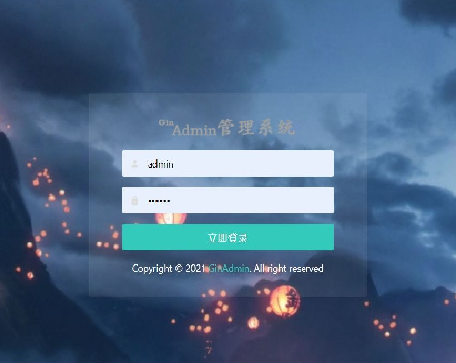
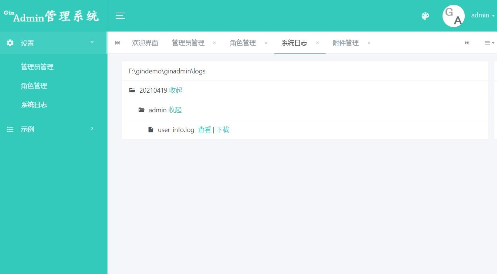

# GinAdmin
The project is a background management platform based on gin framework. Although many people think that go is used to develop high-performance server-side projects, it is inevitable that there is a need to do web management side. You can't use other languages to develop it. Therefore, the ginadmin project has been integrated. Please give more comments and corrections! 





## Dependence
* golang > 1.8
* Gin
* BootStrap
* LayUi
* WebUpload
* [Light Year Admin Using Iframe](#https://gitee.com/yinqi/Light-Year-Admin-Using-Iframe)

## Function list

:white_check_mark:Rbac

:white_check_mark:Logging

:white_check_mark:Template

:white_check_mark:Paginate

:white_check_mark:Docker deployment

:white_check_mark:Static resource packaging

:white_check_mark:Performance monitoring

## Documents
- [Demourl](#演示地址)

- [Getting Started](#开始使用)
- [docker-compose](#docker-compose)
- [Project Directories](#结构)
- [Paginate](#分页)
- [Logging](#日志)
- [GORM](#数据库)
- [Crontab](#定时任务)
- [Configure](#配置文件)
- [Template](#模板页面)
- [Rbac](#用户权限)
- [API Doc](#API文档)
- [Deployment](#线上部署)
- [Performance monitoring](#性能监控)

### :small_blue_diamond:<a name="演示地址">Demourl</a>
* http://122.152.196.83/admin/login  Account：admin Password： 111111

### :small_blue_diamond:<a name="开始使用">Getting Started</a>

1. Clone the project

   ```
   git clone https://github.com/gphper/ginadmin.git
   ```

2. Download mod

   ```go
   go mod download
   ```

3. Config `configs/config.ini`

   ```
   [mysql]
   username=root
   password=123456
   database=db_beego
   host=127.0.0.1
   port=3306
   max_open_conn=50
   max_idle_conn=20
   [redis]
   addr=localhost:6379
   db=0
   password=""
   [session]
   session_name=gosession_id
   [base]
   port=:8091
   ```

4. Run `go run main.go`  Visit http://localhost:port/admin/login。Account：admin  Password：111111

### :small_blue_diamond:<a name="docker-compose">docker-compose</a>

1. Replace `configs/config.ini`

   ```ini
   [mysql]
   username=docker
   password=123456
   database=docker_mysql
   host=localmysql
   port=3306
   max_open_conn=50
   max_idle_conn=20
   [session]
   session_name=gosession_id
   [base]
   host=0.0.0.0
   port=20010
   fill_data=true
   ```

2. Run `docker-compose up`

### :small_blue_diamond:<a name="结构">Project Directories</a>

```
|--api  // Api Controllers
|--build 
|--cmd 
|--configs // Configration
|--deployments // docker-compose deployment
|--internal 
|--logs // Logging
|--pkg // Common method
|--web //Static resources
```

### :small_blue_diamond:<a name="分页">Paginate</a>

1.  Use `pkg/comment/util.go`  `PageOperation` 
    ```go
    adminDb := models.Db.Table("admin_users").Select("nickname","username").Where("uid != ?", 1)
    adminUserData := comment.PageOperation(c, adminDb, 1, &adminUserList)
    ```
2. Use in template
   ```go
   {{ .adminUserData.PageHtml }}
   ```

### :small_blue_diamond:<a name="日志">Logging</a>
1.  System Log
    
    Set the routing middleware to collect system logs and error logs.  `internal/router/default.go` 
    
2.  Custom Log
    
    Use  `loggers.LogInfo()`   in  `github.com/gphper/ginadmin/pkg/loggers`
    
    ```golang
    loggers.LogInfo("admin", "this is a info message", map[string]string{
    		"user_info": "this is a user info",
    })
    ```
    
3. Switching storage media

   * System Log in `internal/router/default.go`  switch storage media

   * Custom Log in `loggers.LogInfo`  method use`facade.NewZaplog`  and  `facade.NewRedislog`  switch storage media

### :small_blue_diamond:<a name="数据库">ORM</a>

1. Models must define `TableName() string`  method, write the pointer implementing the structure into the `GetModels` method.

   ```go
   func GetModels() []interface{} {
   	return []interface{}{
   		&AdminUsers{},
   		&AdminGroup{},
   	}
   }
   ```

2. Model needs to inherit `BaseModle` and implement `TableName` method. If it needs to initialize and fill data, it needs to implement `FillData()` method and write the code to be executed for data filling into the function body. Please refer to `AdminUsers` for details.

3. You can set `full_ Data ` and ` migrate_ table ` in the ini configuration file to control whether the data table and data are automatically migrated and seeded when the program is restarted.

### :small_blue_diamond:<a name="定时任务">Crontab</a>

-    In `pkg/cron/cron.go`  add timed task.

### :small_blue_diamond:<a name="配置文件">Configration</a>

1. First, in `configs/config.go` add struct type of configuration item，eg:

   ```go
   type AppConf struct {
   	BaseConf `ini:"base"`
   }
   type BaseConf struct {
   	Port string `ini:"port"`
   }
   ```

2. Second,  in `configs/config.ini` add configuration information

   ```
   [base]
   port=:8091
   ```

3. Using configuration information in code.

   ```go
   configs.App.BaseConf.Port
   ```

### :small_blue_diamond:<a name="模板页面">Template</a>

- 所有的后台模板都写到 `web/views/template` 目录下面，并且分目录存储，调用时按照 `目录/模板名称` 的方式调用


### :small_blue_diamond:<a name="用户权限">Rbac</a>

- In `internal/menu/menu.go` define permission name，then edit permissions in user group management.

- casbin版集成了casbin权限管理框架，官方地址：[casbin](#https://casbin.org/docs/zh-CN/get-started)

- 框架中的常用方法定义在  `comment/auth/casbinauth/asbin.go` 文件中

- 在控制器中可用从 `gin.context` 获取登录用户信息

  ```go
  info,_ := c.Get("userInfo")
  ```

- template 中判断权限的函数 `judgeContainPriv` 定义在 `pkg/template/default.go` 文件下

  ```go
  "judgeContainPriv": func(username string, obj string, act string) bool {
  		if username == "admin" {
  			return true
  		}
  		ok, err := casbinauth.Check(username, obj, act)
  		if !ok || err != nil {
  			return false
  		}
  		return true
  },
  ```

### :small_blue_diamond:<a name="API文档">API Doc</a>

- Use swagg generate api doc.

  ```swag init -g cmd/ginadmin/main.go```
  
- On root path run  `go build .\cmd\ginadmin\` ,then visit  http://localhost:20010/swagger/index.html

### :small_blue_diamond:<a name="线上部署">Deployment</a>

-  Generate online version  `go build -tags=release .\cmd\ginadmin`  
- Packaged static resource deployment  `go build -tags=embed .\cmd\ginadmin` 

### :small_blue_diamond:<a name="性能监控">Performance monitoring</a>

* Prometheus and grafana is recommended for performance monitoring，refer to  https://github.com/gphper/ginmonitor
